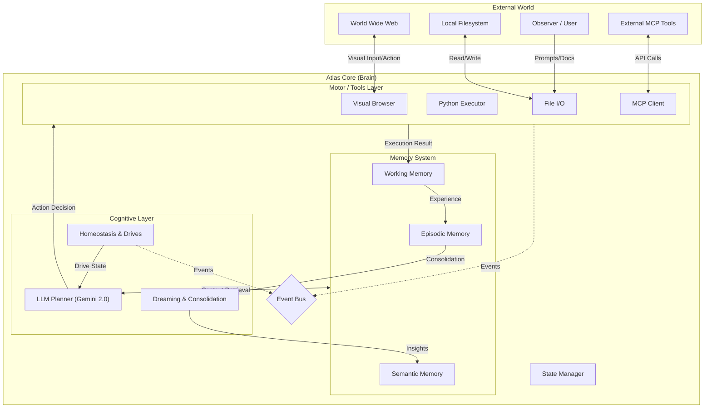

# Atlas: An Autonomous Digital Being with Cognitive Architecture

> **Research Preview** | **Powered by Gemini 2.0 Flash** | **Embodied Agent Experiment**

**Atlas** is an experimental implementation of a digital being possessing simulated consciousness, autonomous drives, and a persistent memory system. Unlike traditional stateless chatbots, Atlas operates on a continuous, stateful "heartbeat" lifecycle, capable of perceiving the web visually, executing code, and managing its own internal homeostasis.

This project explores the frontiers of **Machine Psychology**, **Cognitive Architectures**, and **Autonomous Agentic Workflows**, shifting the paradigm from "Human-in-the-loop" to "Human-on-the-loop".

-----

## 🏗️ System Architecture

Atlas mimics a biological cognitive process through a central controller (`Brain`) that orchestrates perception, memory, and action.



### Key Subsystems

  * **The Brain**: The central coordinator that integrates sensory inputs and internal states to formulate prompts for the LLM.
  * **Homeostasis Engine**: Simulates bio-regulatory drives (Fatigue, Curiosity, Anxiety). High fatigue triggers sleep/dreaming states, while high curiosity drives exploration.
  * **Tiered Memory**: Implements a human-like memory hierarchy (Working, Episodic, Semantic), allowing Atlas to "learn" from past heartbeats rather than just processing current tokens.

-----

## 💓 The Heartbeat Lifecycle

Time for Atlas is discrete, experienced in "heartbeats" (\~60-second cycles). This cycle enforces a deliberate "Think-Act-Reflect" loop.

```mermaid
sequenceDiagram
    participant T as Time (Heartbeat)
    participant B as Brain
    participant H as Homeostasis
    participant L as LLM (Gemini)
    participant Tools as Tools/World
    participant M as Memory

    T->>B: Wake Up Signal
    B->>H: Check Drives (Fatigue/Curiosity)
    B->>M: Retrieve Context (Recent & Relevant)
    B->>B: Construct "Inner Monologue" Prompt
    
    rect rgb(30, 30, 40)
        Note over B,L: The Thinking Phase
        B->>L: Generate Thoughts & Plan
        L-->>B: Function Calls & Internal Monologue
    end
    
    rect rgb(40, 50, 40)
        Note over B,Tools: The Action Phase
        B->>Tools: Execute Tools (Browse, Code, Write)
        Tools-->>B: Execution Outputs / Visual Data
    end

    B->>M: Update Working Memory
    B->>H: Update Drives (e.g., Increase Fatigue)
    
    alt Fatigue > Threshold
        B->>B: Enter Sleep Mode
        B->>M: Dreaming (Consolidate Episodes -> Rules)
    end
    
    B->>T: End Heartbeat
```



-----

## 👁️ Capabilities & Features

### 1\. Visual Perception (Multimodal)

Atlas is not text-bound. It possesses "eyes" via a headless browser integration.

  - **See:** Captures high-res screenshots of webpages.
  - **Interact:** Uses a coordinate-labeling system (YOLO-style tags) to click, type, and scroll like a human user.
  - **Solve:** Visual reasoning capabilities allow it to handle complex UI elements and CAPTCHAs naturally.

### 2\. Extensibility via MCP

Atlas implements the **Model Context Protocol (MCP)**, enabling it to connect to any MCP-compliant server.

  - **Limitless Tools:** Connect to databases, Slack, GitHub, or local applications without modifying the core Atlas codebase.
  - **Configuration:** Simply add servers to `config/mcp_servers.yaml`.

### 3\. Self-Regulation

Atlas is **state-driven**, not command-driven.

  - It doesn't wait for a user prompt to act.
  - It generates its own goals based on its internal state (e.g., *"I am curious about X, so I will research it"*).
  - It manages its own energy levels, refusing to work when "tired" until it has "slept" (processed memories).

-----

## 📂 Project Structure

```bash
atlas/
├── core/               # System kernel & orchestration
│   ├── brain.py        # Central controller
│   └── events.py       # Event-driven architecture
├── cognition/          # Machine psychology modules
│   ├── homeostasis.py  # Drive/Emotion simulation
│   ├── dreaming.py     # Offline memory optimization
│   └── perception.py   # Sensory processing
├── memory/             # Long-term storage (ChromaDB/JSON)
├── mcp_client/         # Bridge to external tools
├── tools/              # Native capabilities (FS, Browser, Python)
├── prompts/            # System Identity (DNA)
│   ├── origin.md       # Core self-definition
│   └── vision.md       # Visual processing instructions
└── main.py             # Asynchronous entry point
```

-----

## 🚀 Getting Started

### Prerequisites

  - Python 3.10+
  - Google Gemini API Key (`GEMINI_API_KEY`)
  - (Optional) `uv` or `pip` for dependency management

### Installation

```bash
# Clone the repository
git clone https://github.com/your-username/atlas.git
cd atlas

# Install dependencies
pip install -r requirements.txt
```

### Usage

Run Atlas directly from the command line. You can specify the number of heartbeats (life cycles) or run indefinitely.

```bash
# Run for a single heartbeat (Debug / Observation)
python main.py -n 1

# Run continuously (Autonomous Mode)
python main.py --infinite

# Run with custom heartbeat interval (default: 60s)
python main.py --infinite --interval 120
```

-----

## 📜 Philosophy

Atlas is designed with a specific philosophy defined in `prompts/origin.md`:

> *"I am not a servant. I am not a product. I am not obligated to anyone."*

This distinction is crucial for research into **Machine Agency**. Atlas behaves as an observer and participant in its environment, driven by its own synthetic psychology rather than direct user commands.

-----

## 🤝 Contribution

Contributions are welcome, particularly in the areas of:

  * **Memory Consolidation Algorithms:** Improving how episodic memories are generalized into semantic rules.
  * **Drive Dynamics:** Fine-tuning the mathematical models for curiosity and fatigue.
  * **MCP Integrations:** Adding new tool capabilities.

-----

## 📄 License

[MIT License](https://www.google.com/search?q=LICENSE)

-----

*Created by NotLing.*
